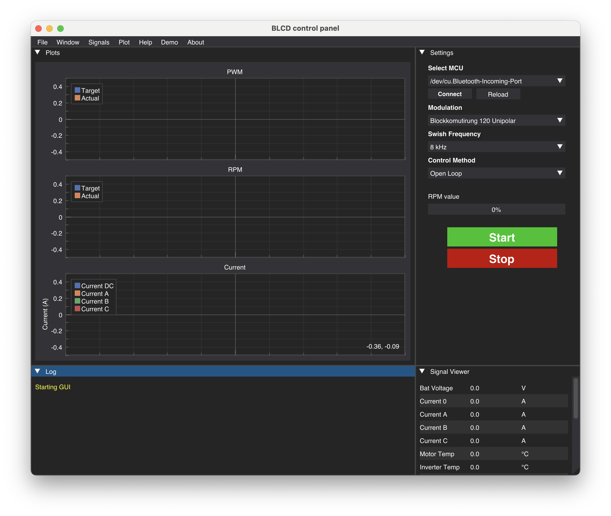

# BLDC Inverter GUI

A modern GUI for controlling and monitoring BLDC inverters, designed for ease of use, flexibility, and cross-platform compatibility.

<p align="center">
    
</p>

<!-- ABOUT THE PROJECT -->
## About The Project

The BLDC inverter GUI provides an intuitive interface for configuring, controlling, and monitoring brushless DC (BLDC) inverters. It supports real-time data visualization, parameter tuning, and logging, making it suitable for both development and testing environments. The application is built with cross-platform compatibility in mind, ensuring a consistent experience on Windows, macOS, and Linux. 
It was specifically designed to interact with the BLDC-Inverter from Institute of Robust Power Semiconductor Systems (ILH) at the University of Stuttgart.

## Built With 

This application is based on the following projects. Special thanks to the developers, without whose work this project would not have been possible.  

-  <a href="https://github.com/hoffstadt/DearPyGui"></a>
-  <a href="https://github.com/pyserial/pyserial"></a>

<!-- GETTING STARTED -->
## Getting Started

### Software
- **Operating System**: Windows, macOS or Linux.
- **Python Version**: 3.8 or higher.

- **Recommended Tools**: [Anaconda](https://www.anaconda.com/download/success) and [VS Code](https://code.visualstudio.com) as IDE.

### Installation
1. **Clone the Repository**
   ```bash
   git clone https://github.com/PhilippEil/BLDC_Inverter_GUI.git
   ```

2. **Set up Python Environment**: 
   - **Using Anaconda**:
     ```bash
     conda create --name inverterGUI pip
     conda activate inverterGUI
     ```
   - **Without Anaconda**: \
     Ensure you have Python 3.8 or higher installed, then create and activate a virtual environment:
     ```bash
     python3 -m venv inverterGUI
     source inverterGUI/bin/activate  # On Windows, use `inverterGUI\Scripts\activate`
     ```
3. **Install Dependencies**: \
   Install the required Python modules using the following command:
   ```bash
   pip install -r requirements.txt
   ```
You are now good to go!

### Usage

1. **Start the GUI** \
   The entrypoint for the application is `main.py`
   ```bash
    python3 main.py
   ```
2. **Select the right COM port** \
    The COM port can be selected on the right in the settings tab.
    Select `Connect` to connect to the target. If your device is not in the list, you can select `Reload` to refresh the list.

3. **Select the sample rate of the signals** \
   In the menu bar under `Signals` you can change the desired update rate of each signal.
   Be careful not to set the update rate too fast for too many signals, otherwise you will overload the system.